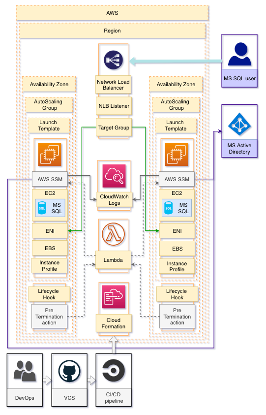

| Build status  | License |
| ------------- | ------------- |
| [](https://circleci.com/gh/kagarlickij/aws-cloudformation-ec2-win-ad-servers)  | [](LICENSE.md)  |

## Task
1. EC2 instances must be automatically added to Active Directory (AD) on provisioning and removed form AD on termination
2. Each EC2 instance must have 3 private IP addresses (required for MS SQL Always-On) assigned by DHCP
2. NLB must be used to expose MS SQL Always-On Listener because it's faster than changing CNAME value
3. Dedicated ASG to keep each instance fault tolerant
4. Dedicated data disks which are re-attached to new instance in ASG with the same disk letters

## Solution



### 1. Adding instances to AD on provisioning
**cfn-init** is used to execute `join-ad.ps1` script on instance during provisioning.

After instance is joined AD it's hostname will be changed from default to instance ID by `rename-computer.ps1` script.

`AWS-JoinDirectoryServiceDomain` isn't used because it's limited to use with AWS Directory Service only.

### 2. Removing instances from AD on termination
When instance is terminated it should be disabled in Active Directory to keep it relevant.

AWS SSM doesn't have built-in functionality for such purposes but it can execute `Remove-Computer` command on instance.

When instance is terminated via ASG:
1. ASG sends event to CloudWatch Events

2. CloudWatch Events rule triggers Lambda

3. Lambda triggers SSM

4. SSM executes script on instance

5. Lambda checks SSM execution result

### 3. cfn-init and UserData logs export to CloudWatch Logs
All PowerShell scripts located in `bootstrap-scripts` are set to put logs to default **cfn-init** log file: `C:\cfn\log\cfn-init.log`

Amazon SSM Agent is used to put those logs to CloudWatch logs; Amazon SSM Agent config is set during **cfn-init** execution; This is done to keep logs available after instance is terminated.

AMI can use outdated version of Amazon SSM Agent, so during **cfn-init** execution existing version is replaced with latest one.

### 4. Domain admin password
Domain admin password is stored in AWS Secret Manager, both InstanceRole and LambdaRole must have read access to that secret.

## Known issues and workarounds
### 1. Windows disks attach, initialize and partition creation with specific letters flow
EBS disks are attached to EC2 instances with `Add-EC2Volume` command.

Attached disks initialized in Windows with `Initialize-Disk` command.

`Add-EC2Volume` doesn't provide any output that can be used as input for `Initialize-Disk`

As a workaround, EBS disks are mounted one by one and when one new disk is attached it's passed to `Initialize-Disk` not as output of `Add-EC2Volume` but as output of `Get-Disk | Where-Object PartitionStyle -eq RAW`

When disk is initialized new partition is created and specific drive letter is assigned: `New-Partition -DriveLetter X`

### 2. Disks re-attachment in case of instance replacement
Disks are not included to LaunchTemplate: they are created and deleted together with CloudFormation stack.

When instance in ASG fails it is replaced with new instance.

The same disks are connected to new instance in the same order. This is done by UserData scripts that reference existing Volume IDs.

When disks are re-attached they will have the same disk letters in Windows.

But if some new disks were added to Windows manually before UserData executed disk letters will be changed.

### 3. Windows hostname is shorter than AWS InstanceID
Windows hostname is limited to [15 characters](https://support.microsoft.com/en-gb/help/909264/naming-conventions-in-active-directory-for-computers-domains-sites-and) but AWS Instance ID has [17 characters](https://aws.amazon.com/blogs/compute/longer-resource-ids-in-2018-for-amazon-ec2-amazon-ebs-and-amazon-vpc/)

### 4. First parse of UserData log by Amazon SSM Agent is not correct
Amazon SSM Agent has correct mask for UserData execution log: `"TimestampFormat": "yyyy/MM/dd HH:mm:ss'Z':"`

However first bunch of events will not be displayed correctly in CloudWatch Logs GUI (further events will be displayed correctly)

### 5. AWS SSM isn't stable enough for Windows
It should be replaced with Elastic Filebeat or something similar.

AWS SSM and CloudWatch are used for demo purposes only.

## Production usage caution
This code is for demo purposes only and should never be used in production.

## Extras
1. Sample event to use for Lambda testing (replace `EC2InstanceId` value):

```json
{
    "account": "709237651222",
    "region": "us-east-2",
    "detail": {
        "LifecycleHookName": "PreTerminationHook",
        "AutoScalingGroupName": "Instance2ASG",
        "LifecycleActionToken": "03788322-7023-4b3b-ada3-0cace632c432",
        "LifecycleTransition": "autoscaling:EC2_INSTANCE_TERMINATING",
        "EC2InstanceId": "i-02d018557dc00fd78"
    },
    "detail-type": "EC2 Instance-terminate Lifecycle Action",
    "source": "aws.autoscaling",
    "version": "0",
    "time": "2019-03-19T15:24:55Z",
    "id": "cc81f074-abe3-9d19-707b-d3dbbaf2bdc2",
    "resources": [
        "arn:aws:autoscaling:us-east-2:709237651222:autoScalingGroup:0a7a118e-a6c1-45ce-9829-a09bec68fc7e:autoScalingGroupName/Instance2ASG"
    ]
}
```

2. This template can be used to add missing parts to [quickstart-microsoft-sql](https://github.com/aws-quickstart/quickstart-microsoft-sql)
